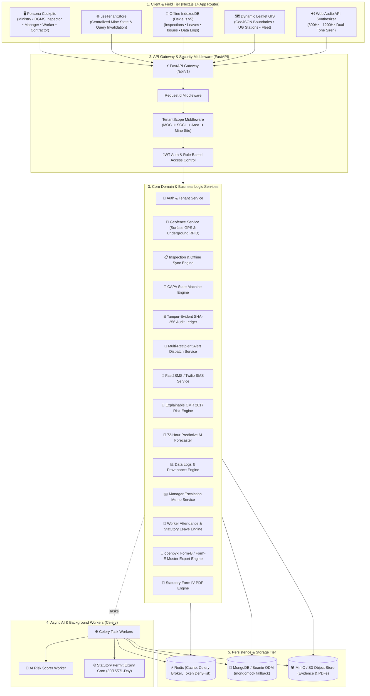

# ⛏️ Coal Mines AI Governance & Statutory Compliance Monitoring System

> **Problem Statement ID: SIH26024** | *Ministry of Coal & DGMS Digital Governance Initiative*  
> An enterprise-grade, offline-first, AI-assisted platform for statutory safety governance, multi-tier compliance monitoring, explainable predictive risk forecasting, cryptographic audit transparency, and resilient field operations across Indian coal mines.

---

## 📌 Executive Summary

Coal mining operations in India operate under rigorous statutory safety, environmental, and operational mandates governed by the **Directorate General of Mines Safety (DGMS)**, **Coal Mines Regulations (CMR 2017)**, **Mines Act 1952**, **Mines Rules 1955**, **CPCB/SPCB**, and **MoEF&CC**.

This platform delivers an end-to-end digital governance architecture engineered for zero-connectivity underground inclines, hierarchical administration (**Ministry ➔ Subsidiary ➔ Area ➔ Mine Site**), dynamic multi-mine GIS positioning, automated CMR 2017 composite risk scoring, forward-looking 72-hour AI hazard forecasting, strict corrective action workflows (CAPA), tamper-evident cryptographic audit ledger protection with Web Audio emergency sirens, and multi-recipient emergency SMS dispatch.

---

## 🌟 Key Capabilities & Architectural Innovations

### 1. 🛡️ Cryptographic SHA-256 Audit Ledger, Tamper Interception & Web Audio Siren
- **Canonical SHA-256 Block Chaining**: Deterministic block hashing: $H_n = \text{SHA256}(H_{n-1} \parallel \text{Seq} \parallel \text{Actor} \parallel \text{CanonicalPayload})$ using key-sorted JSON serialization.
- **Repository-Level Tamper Interception**: Any mutation attempt on statutory records (shift gas telemetry, worker muster, inspection logs, or CAPA notices) marked `COMMITTED` or `APPROVED` is intercepted before execution, rejected with `HTTP 403 Forbidden`, and committed as an emergency tamper violation block.
- **Audible Emergency Siren (`frontend/src/lib/utils/audio.ts`)**: Synthesizes an alternating dual-tone emergency siren (800Hz–1200Hz) via the HTML5 Web Audio API without external audio files. Safe for browser autoplay policies.
- **Audible Pop-Up Alert Modal (`EmergencyAlertModal.tsx`)**: Mounted globally in the dashboard layout for `MINISTRY_AUDITOR` and `DGMS_INSPECTOR`. Triggers the audible siren and displays the affected mine, altered field, sequence number, and real-time hash divergence.
- **Interactive Forensic Timeline (`/audit-ledger`)**: Visualizes the cryptographic block sequence with previous/current hash badges. Includes a **`[ 🚨 Simulate Database Tampering Attack ]`** button executing `POST /api/v1/audit-ledger/simulate-tamper` for live jury and regulatory demonstrations.

### 2. 📱 Multi-Recipient SMS Emergency Alert Dispatch
- **SMS Infrastructure (`app/services/sms_service.py`, `alert_dispatch_service.py`)**: Integrates Fast2SMS (10-digit Indian numbers) and Twilio (E.164 format) with structured fallback console logging (`[MOCK SMS STATUTORY EMERGENCY DISPATCH]`).
- **Diagnostic Testing Endpoint (`POST /api/v1/escalations/test-sms`)**: On-demand diagnostic endpoint supporting `TAMPER_ALERT`, `WORKER_EMERGENCY`, `PREDICTIVE_GAS_WARNING`, or custom phone dispatches.
- **Automated Statutory Dispatch Triggers**:
  - **Tamper Ledger Divergence**: SMS dispatched to Ministry Auditor (`+917842295449`), DGMS Inspector (`+918919912916`), and Colliery Manager (`+919876543212`):
    `🚨 DGMS STATUTORY ALERT: Unauthorized record tampering attempt detected at {mine_name}. Ledger block #{seq} invalidated. Ref: SIH26024`
  - **Worker Emergency Stop Grievance**: SMS dispatched to Colliery Manager and Shift Sirdar (`+919876543215`):
    `⚠️ EMERGENCY PIT ALERT: Immediate safety threat reported at {mine_name}, Gallery {location_desc}. Worker hazard halt triggered. Check portal immediately.`
  - **72-Hour Spontaneous Combustion Warning**: SMS dispatched to Colliery Manager and DGMS Inspector:
    `🔴 CMR 2017 EARLY WARNING: AI forecast predicts spontaneous heating (CO rate > 3ppm/hr) at {mine_name} in {hours}h. Proactive ventilation adjustment required.`

### 3. 📊 Colliery Manager Triple-Tab Data Logs Portal (`/data-logs`)
- **Tab 1: Atmospheric Configuration**: Time-series sensor streams ($\text{CH}_4, \text{CO}, \text{O}_2$, air velocity, temperature) with statutory threshold status badges (`NORMAL`, `EXCURSION_WARNING`, `STATUTORY_BREACH`) and SHA-256 fingerprint badges. Includes an interactive "Edit" button that demonstrates immutable tamper rejection (HTTP 403).
- **Tab 2: Worker Muster**: Shift biometric timestamps, underground gallery deployment, CO gas exposure, and statutory overtime violation warnings ($>8\text{h}$).
- **Tab 3: Mine Casts & Extraction**: Opencast bench excavation tonnage, daily quota achievement %, dumper trips count, explosives used (kg ANFO), and blasting safety clearances.

### 4. 🔮 72-Hour Predictive AI Safety & Hazard Forecaster (`/analytics`)
- **Forward Sequence Modeling**: Projects atmospheric safety trends across $t+24\text{h}$, $t+48\text{h}$, and $t+72\text{h}$ using historical telemetry velocity and acceleration.
- **Dual-Line Visualizer with 95% Confidence Intervals**: Displays transition from actual historical sensor data to projected forecasts with shaded 95% Confidence Interval bands ($\pm 1.96 \cdot \text{SE} \cdot \sqrt{t/24}$).
- **Statutory Tripwire Warning Engine**: Real-time hazard tripwires for methane excursions ($\text{CH}_4 \ge 0.75\%$) and spontaneous combustion ($\frac{d\text{CO}}{dt} \ge 3\text{ ppm/hr}$).

### 5. 👷 Worker Welfare & Statutory Leave Portal (`WorkerDashboard.tsx`)
- **Hazard & Emergency Stop Reporting**: Categorized grievance reporting (Ventilation, Strata/Roof Support, Machinery, Welfare). Selecting `urgency == "EMERGENCY_STOP"` halts work and dispatches high-priority pit alerts to Colliery Manager and Sirdar.
- **Statutory Leave Applications (Mines Rules 1955 Chapter VII)**: Enables workers to apply for `CASUAL`, `SICK_MEDICAL`, `EARNED_STATUTORY`, and `ACCIDENT_COMPENSATORY` leaves, track application status and balances, and allows Colliery Managers to review and approve/reject shift leaves.

### 6. 📑 Form B / Form E Attendance Spreadsheet Exports (`/attendance`)
- **Native Excel Generation**: Built using `openpyxl>=3.1.5` at `GET /api/v1/attendance/export`.
- **Formatted Statutory Output**: Streams formatted **DGMS Form B / Form E Coal Mines Muster** in `.xlsx` or `.csv` with shift filters, zone filters, and toxic gas exposure highlights.
- **1-Click Download**: Integrated directly into the attendance cockpit.

### 7. 🗺️ Location-Reactive Data Hydration & Leaflet GIS Map
- **Global Tenant Store (`useTenantStore`)**: Selecting any mine site from the top navbar immediately triggers TanStack Query cache invalidation across all mine queries (`telemetry`, `data-logs`, `muster`, `risk-score`) and synchronizes the URL query parameter `?mine_id=...`.
- **Smooth Leaflet Camera Flight (`leasehold-map.tsx`)**: Invokes `map.flyTo(center, 14, { duration: 1.5 })`, converts GeoJSON coordinates to `[lat, lng]`, outlines active opencast pit perimeters, and renders underground RFID station beacons.
- **Contractor GIS Cockpit (`ContractorPitMap.tsx`)**: Displays all 4 Telangana sites simultaneously with auto-bounds fitting (`fitBounds`), fleet vehicle markers for dumpers/shovels, speed violations, and bench extraction limits.

### 8. 📶 Universal Offline-First Architecture & Auto-Reconciliation (Dexie.js v5)
- **IndexedDB Stores**: Dedicated tables for `offlineInspections`, `offlineWorkerReports`, `offlineLeaves`, `offlineManagerActions`, `cachedMines`, and `cachedDataLogs`.
- **Deterministic Auto-Sync Engine (`sync-engine.ts`)**: Background listener on `window.addEventListener("online")` with execution locking (`isSyncing = true`) and client UUID idempotency keys to flush queued mutations without duplication.
- **Visual Network Banner (`OfflineStatusBar.tsx`)**: Real-time status bar displaying offline mode, pending sync counts, and manual `[ 🔄 Sync Now ]` action.

### 9. ⚖️ Persistent Statutory Safety Directives Footer (`SafetyDirectivesFooter.tsx`)
- Mounted globally at the bottom of every dashboard page: displays mandatory statutory rules under **CMR 2017** (Reg 153 gas limits, Reg 154 ventilation, Reg 123 SSR roof support, Reg 130 haul roads, Rule 29B PPE).

---

## 🧠 Explainable CMR 2017 AI Safety Risk Engine

The composite risk calculator evaluates mine safety using a weighted, explainable multi-pillar statutory formula:

$$S_{\text{risk}} = \min\left(100, \; w_g \cdot G + w_c \cdot C + w_m \cdot M + w_e \cdot E + P_{\text{stale}}\right)$$

| Pillar | Weight | Evaluated Parameters | Statutory Regulation |
| :--- | :---: | :--- | :--- |
| **$G$ — Gas & Atmosphere** | **35%** | $\text{CH}_4$ (Methane %), $\text{CO}$ (PPM), $\frac{d\text{CO}}{dt}$ rate of rise, $\text{O}_2$ deficiency | CMR 2017 Reg 153 |
| **$C$ — CAPA Violations** | **25%** | Unrectified statutory violation notices, severity weights, overdue rectifications | CMR 2017 Statutory Orders |
| **$M$ — Mine Depth & Seam** | **20%** | Incline depth (meters), Gassy Seam Degree (Degree I, II, or III) | DGMS Circulars |
| **$E$ — Equipment & Slope** | **20%** | Overdue HEMM maintenance, Opencast Bench Factor of Safety ($\text{FoS}$), 24h rainfall (mm) | CMR 2017 Reg 130 |
| **$P_{\text{stale}}$ — Data Staleness** | **0–15 pt** | Penalty applied when sensor telemetry or shift logs exceed 2, 6, 12, or 24 hours | Data Governance Standard |

---

## 👥 Five Statutory Active Personas

Legacy roles (`SAFETY_OFFICER`, `SUBSIDIARY_ADMIN`) have been pruned to enforce strictly the 5 active statutory roles:

| Persona | Primary Statutory Role | Dedicated Cockpit Features |
| :--- | :--- | :--- |
| 🏛️ **`MINISTRY_AUDITOR`** | National Macro Governance & Oversight | Pan-India subsidiary compliance heatmap, statutory tamper alert monitor, emergency audible siren, macro risk analytics. |
| 🧭 **`DGMS_INSPECTOR`** | Statutory Safety Enforcement (DGMS) | Field audit schedules, GPS geofence breach detection, violation notice issuance, Form-IV PDF generation, audible siren alert. |
| 🛡️ **`COLLIERY_MANAGER`** | Mine Operations & Statutory Authority | Live pit risk score meter, triple-tab data logs, official Ministry memo dispatch, worker leave approval, SMS alert recipient. |
| ⛑️ **`FIELD_WORKER` / `MINING_SIRDAR`** | Ground Safety & Hazard Logging | Biometric shift presence, underground gallery gas monitors, emergency stop hazard reporting, statutory leave applications. |
| 🚚 **`CONTRACTOR_ADMIN`** | Heavy Machinery & Haulage Logistics | Opencast bench excavation assignments, shift tonnage progress vs target, heavy fleet fitness certificates, speed tracking. |

---

## 🏗️ System Architecture



---

## 💻 Tech Stack

| Layer | Technologies |
| :--- | :--- |
| **Backend API** | [FastAPI](https://fastapi.tiangolo.com/), Python 3.11+, Pydantic v2, Structlog |
| **Database & ODM** | [MongoDB 7.0+](https://www.mongodb.com/) via [Beanie ODM](https://beanie-odm.dev/) & Motor (`mongomock` fallback for local dev) |
| **Spreadsheets & Reports** | [openpyxl](https://openpyxl.readthedocs.io/) (DGMS Form-B/Form-E Excel), ReportLab (Form-IV PDF) |
| **Task Queue & Cache** | [Celery](https://docs.celeryq.dev/), [Redis](https://redis.io/) |
| **Storage** | [MinIO](https://min.io/) / AWS S3 (Presigned URLs) |
| **Frontend Framework** | [Next.js 14.2](https://nextjs.org/) (App Router), [React 18](https://react.dev/), [Tailwind CSS](https://tailwindcss.com/), [Lucide Icons](https://lucide.dev/) |
| **Audio Synthesis** | HTML5 Web Audio API (Dual-tone 800Hz–1200Hz siren oscillator) |
| **State & Fetching** | [Zustand](https://github.com/pmndrs/zustand), [TanStack React Query v5](https://tanstack.com/query), [Dexie.js v5](https://dexie.org/) (IndexedDB) |
| **Mapping & GIS** | [Leaflet](https://leafletjs.com/), [React-Leaflet](https://react-leaflet.js.org/) |
| **Testing** | [pytest](https://docs.pytest.org/), pytest-asyncio, HTTPX |

---

## 📁 Repository Structure

```text
ai-coal-goverance/
├── app/                                    # Backend Application (FastAPI)
│   ├── api/v1/                             # API Endpoints
│   │   ├── attendance.py                   # Worker check-in, muster & Form-B Excel export
│   │   ├── audit.py                        # Audit ledger verification & tamper simulation
│   │   ├── auth.py                         # Authentication & JWT token refresh
│   │   ├── compliance.py                   # Statutory permits & alert acknowledgment
│   │   ├── dashboard.py                    # Role-tailored dashboard summaries
│   │   ├── documents.py                    # S3 presigned upload & OCR triggering
│   │   ├── escalations.py                  # Manager memo dispatch & test-sms endpoint
│   │   ├── inspections.py                  # Inspection logging & Form-IV generation
│   │   ├── logs.py                         # Shift gas, muster & extraction data logs
│   │   ├── notifications.py                # Notification center & acknowledgments
│   │   ├── reports.py                      # Form IV PDF generation & export
│   │   ├── risk.py                         # Composite risk score & 72h forecast endpoints
│   │   ├── router.py                       # Main API v1 routing registry
│   │   ├── schedules.py                    # Preventive safety audit calendars
│   │   ├── sync.py                         # Offline batch push/pull & conflict resolution
│   │   ├── tenants.py                      # Hierarchy & Telangana mine site management
│   │   ├── underground_stations.py         # Depth & RFID beacon stations
│   │   ├── violations.py                   # CAPA workflow state transitions
│   │   └── worker.py                       # Worker issues & statutory leave applications
│   ├── domain/                             # Core Domain Logic (Pure Python)
│   │   ├── enums.py                        # 5 Active statutory roles & domain enums
│   │   ├── predictive_ai.py                # 72-hour AI safety forecaster
│   │   └── risk_scorer.py                  # Explainable CMR 2017 composite risk engine
│   ├── infrastructure/                     # Infrastructure layer
│   │   ├── cache/                          # Redis connection & token denylist
│   │   ├── database/                       # MongoDB Beanie ODM connection & models
│   │   │   ├── models.py                   # 14 Beanie document models with phone_number
│   │   │   └── seeds/                      # Master data seed scripts
│   │   │       └── telangana_mines.py      # Telangana SCCL 4-mine master seed & credentials
│   │   └── storage/                        # MinIO / S3 object storage service
│   ├── middleware/                         # Request ID, Tenant Scoping, Auth
│   ├── services/                           # Domain Services (SMS, Alert Dispatch, Audit, Sync, PDF)
│   │   ├── alert_dispatch_service.py       # Multi-recipient statutory emergency routing
│   │   ├── audit_service.py                # SHA-256 chained ledger & tamper interceptor
│   │   ├── sms_service.py                  # Fast2SMS & Twilio SMS dispatcher
│   │   └── ...
│   ├── workers/                            # Celery workers & Beat cron schedules
│   ├── config.py                           # App settings via Pydantic Settings
│   ├── dependencies.py                     # FastAPI dependency injections
│   └── main.py                             # FastAPI application factory
├── frontend/                               # Next.js 14 Dashboard
│   ├── src/
│   │   ├── app/                            # App Router routes (22 routes)
│   │   │   ├── (dashboard)/                # Authenticated dashboard pages
│   │   │   │   ├── analytics/              # 72h Predictive AI forecaster & charts
│   │   │   │   ├── attendance/             # Attendance muster & Excel (.xlsx) download
│   │   │   │   ├── audit-ledger/           # SHA-256 ledger & attack simulation button
│   │   │   │   ├── capa/                   # CAPA state machine & notice tracking
│   │   │   │   ├── compliance/             # Statutory permit calendar & CTOs
│   │   │   │   ├── contractor/             # Contractor sub-pages (production, risk-score, mines)
│   │   │   │   ├── data-logs/              # Colliery shift logs (Atmosphere, Muster, Extraction)
│   │   │   │   ├── inspections/            # Inspection records & Form IV downloads
│   │   │   │   ├── map/                    # Dynamic Leaflet GIS boundary & UG stations
│   │   │   │   ├── overview/               # Multi-persona dashboard hub
│   │   │   │   ├── schedules/              # Scheduled audit calendars
│   │   │   │   └── worker/issues/          # Dedicated worker grievance & hazard portal
│   │   │   └── login/                      # Role-based login page
│   │   ├── components/                     # Modular UI components
│   │   │   ├── alerts/                     # EmergencyAlertModal & AuditWatchdog
│   │   │   ├── audit/                      # Cryptographic chain verification banner
│   │   │   ├── capa/                       # CAPA board & status transition modals
│   │   │   ├── dashboard/                  # 5 Persona dashboards (Inspector, Manager, Worker, Govt, Contractor)
│   │   │   ├── geospatial/                 # Leaflet GIS maps & underground levels
│   │   │   ├── layout/                     # Sidebar, top-navbar, MineSelector, OfflineStatusBar, SafetyDirectivesFooter
│   │   │   └── scorecard/                  # Dynamic risk meters & KPI grids
│   │   └── lib/                            # API clients, Dexie DB, Zustand stores, Web Audio API
│   │       ├── api/                        # Typed API clients (logs, worker, dashboard, tenants)
│   │       ├── db/                         # Dexie.js v5 offline database (CoalGovOfflineDB)
│   │       ├── store/                      # Zustand stores (auth, tenant, sync, audit-alert)
│   │       ├── sync/                       # Two-way offline sync manager & engine
│   │       ├── types/                      # TypeScript domain definitions (5 roles)
│   │       └── utils/                      # audio.ts (Web Audio siren), hashes, coords, dates
│   ├── public/                             # Static assets
│   ├── package.json                        # Frontend dependencies
│   └── tsconfig.json                       # TypeScript config
├── scripts/
│   └── verify_db.py                        # Database & Redis health check & seeding CLI
├── tests/                                  # Unit & Integration test suite
│   ├── unit/                               # 16 Unit test modules (80 tests)
│   └── integration/                        # Integration test modules
├── .env.example                            # Environment variables template
├── pyproject.toml                          # Python packaging config
└── requirements.txt                        # Python pip dependencies
```

---

## 🔑 Demo Seed Accounts & Verified Mobile Directory

All seed accounts use the default password: `demo1234`

| Role | Email | Name & Organization | Verified Mobile | Hierarchy Scope |
| :--- | :--- | :--- | :--- | :--- |
| **`MINISTRY_AUDITOR`** | `auditor.hq@coal.gov.in` | Dr. R. K. Sharma *(Ministry Auditor)* | `+917842295449` | `MOC` (Pan-India) |
| **`DGMS_INSPECTOR`** | `inspector.dgms@dgms.gov.in` | Er. K. Venkat Rao *(DGMS South Central Zone)* | `+918919912916` | `MOC` (Statutory Jurisdiction) |
| **`COLLIERY_MANAGER`** | `manager.gdk11a@scclmines.com` | N. Ramesh *(Colliery Manager - GDK 11A)* | `+919876543212` | `MOC.SCCL.RAMAGUNDAM_1.GDK_11A` |
| **`FIELD_WORKER`** | `sirdar.kasipet@scclmines.com` | K. Shankaraiah *(Mining Sirdar - Kasipet)* | `+919876543215` | `MOC.SCCL.MANDAMARRI.KASIPET_UG` |
| **`CONTRACTOR_ADMIN`** | `contractor.singareni@scclmines.com` | T. Rajesh *(Singareni HEMM Fleet Operations)* | `+919876543216` | `MOC.SCCL.RAMAGUNDAM_2.RG_OCP3` |

### 4 Distinct Telangana SCCL Collieries Seeded

1. **Godavarikhani No. 11A Incline (GDK-11A)**: Underground, Degree III Gassy Seam, Depth: 380m, Center: `[18.7610, 79.4985]`, Stations: `STATION-GDK-SHAFT-BOTTOM` (-380m), `STATION-GDK-SEAM3-FACE` (-340m, RFID: `RFID-TEL-GDK-01`), $\text{CH}_4$: 0.62%, $\text{CO}$: 14.2 ppm, Air Velocity: 1.4 m/s, Risk: 64.
2. **Ramagundam OCP-III (RG-OCP 3)**: Opencast, Depth: 120m, Center: `[18.7562, 79.5134]`, Bench FoS: 1.32, Active Dumpers: 34, Daily Output: 18,400 T / Target: 20,000 T, Risk: 28.
3. **Kasipet Underground Mine**: Underground, Degree II Gassy Seam, Depth: 260m, Center: `[19.0321, 79.4412]`, Stations: `STATION-KASIPET-INCLINE-1`, `STATION-KASIPET-RETURN-AIRWAY`, $\text{CH}_4$: 0.41%, $\text{CO}$: 8.5 ppm, Air Velocity: 2.1 m/s, Risk: 45.
4. **Kothagudem OCP (KOCP)**: Opencast, Depth: 195m, Center: `[17.5518, 80.6189]`, Bench FoS: 1.18 (Critical Warning), Active Dumpers: 22, Daily Output: 12,100 T / Target: 15,000 T, Risk: 72.

---

## ⚙️ Quickstart & Setup Guide

### 1. Prerequisites
- **Python 3.11+**
- **Node.js 18+ & npm**
- **MongoDB 7.0+** *(Built-in in-memory fallback to `mongomock` is active when MongoDB is unavailable)*
- **Redis 7.0+** *(Optional for local dev)*

---

### 2. Backend Setup

1. **Activate virtual environment:**
   ```bash
   # Windows PowerShell:
   .venv\Scripts\activate
   # Linux / macOS:
   source .venv/bin/activate
   ```

2. **Install Python dependencies:**
   ```bash
   pip install -r requirements.txt
   ```

3. **Configure environment variables:**
   ```bash
   cp .env.example .env
   ```

4. **Verify database & seed master records:**
   ```bash
   python scripts/verify_db.py --seed
   ```

5. **Start the FastAPI Backend Server:**
   ```bash
   uvicorn app.main:app --host 127.0.0.1 --port 8000 --reload
   ```
   - Interactive Swagger API Documentation: `http://127.0.0.1:8000/docs`
   - ReDoc Documentation: `http://127.0.0.1:8000/redoc`

---

### 3. Frontend Setup

1. **Navigate to the frontend directory:**
   ```bash
   cd frontend
   ```

2. **Install Node dependencies:**
   ```bash
   npm install
   ```

3. **Configure environment variables:**
   Ensure `frontend/.env.local` contains:
   ```env
   NEXT_PUBLIC_API_URL=http://localhost:8000/api/v1
   ```

4. **Run development server:**
   ```bash
   npm run dev
   ```
   Open `http://localhost:3000` in your browser.

---

## 🧪 Testing & Verification

### Run Backend Test Suite (pytest)
```bash
.venv\Scripts\pytest -q tests/unit/
```
*Current test suite status: **80 passed in ~14s (100% pass rate)***.

### Run Frontend Production Build (Next.js)
```bash
cd frontend
npm run build
```
*Current build status: **Exit Code 0**, 22/22 static & dynamic routes compiled without errors.*

---

## 🎮 Interactive Live Demo Walkthrough

1. **Test Colliery Data Logs & Tamper Rejection (`/data-logs`)**:
   - Log in as Colliery Manager (`manager.gdk11a@scclmines.com`).
   - Navigate to `/data-logs` in the sidebar.
   - Switch between **Atmospheric Configuration**, **Worker Muster**, and **Mine Casts & Extraction**.
   - Under Atmospheric Configuration, click **"Edit"** on any sensor row.
   - Modify a parameter (e.g. CO PPM) and click **"Edit"**.
   - Observe immediate **HTTP 403 Statutory Rejection**, generation of a permanent SHA-256 Audit Block, and instant dispatch of `CRITICAL` alerts to DGMS and Ministry dashboards.

2. **Test Audible Siren & Live Database Attack Simulation (`/audit-ledger`)**:
   - Navigate to `/audit-ledger`.
   - Click the **`[ 🚨 Simulate Database Tampering Attack ]`** button.
   - The HTML5 Web Audio API synthesizes an alternating 800Hz–1200Hz emergency siren.
   - The animated `EmergencyAlertModal` surfaces on screen displaying affected mine, altered field, sequence number, and hash divergence.
   - Test the **Mute Siren** toggle and click **"Inspect Audit Chain"**.

3. **Test Diagnostic SMS Alert Dispatch (`POST /api/v1/escalations/test-sms`)**:
   - In Swagger UI (`http://127.0.0.1:8000/docs`) or via curl:
     ```bash
     curl -X POST "http://127.0.0.1:8000/api/v1/escalations/test-sms" \
          -H "Content-Type: application/json" \
          -d '{"event_type": "TAMPER_ALERT", "mine_name": "Godavarikhani No. 11A Incline"}'
     ```
   - Verify SMS dispatch dispatched to Ministry (`+917842295449`) and Inspector (`+918919912916`).

4. **Test Statutory Attendance Spreadsheet Export (`/attendance`)**:
   - Navigate to `/attendance`.
   - Click **`[ 📥 Export Statutory Muster (.xlsx) ]`**.
   - The system streams formatted **DGMS Form B / Form E Coal Mines Muster** in `.xlsx` with official headers, shift summaries, and toxic gas exposure highlights.

5. **Test Multi-Mine Selector & Dynamic Leaflet GIS (`/map`)**:
   - In the top navigation bar, click the **Mine Selector** dropdown.
   - Switch between **GDK-11A**, **Ramagundam OCP-3**, **Kasipet**, and **Kothagudem OCP**.
   - Observe the Leaflet map smoothly fly (`map.flyTo`) to the new coordinates, re-draw the active leasehold boundary polygon, and load mine-specific telemetry and underground station beacons.

6. **Test Universal Offline Pit Mode & Dexie Sync (`/worker/issues`)**:
   - In browser DevTools Network tab, toggle **Offline**.
   - Notice the amber **"OFFLINE MODE: Operating on local pit cache"** status bar.
   - Submit a hazard report or statutory leave application.
   - Inspect DevTools IndexedDB (`CoalGovOfflineDB`); verify the record is persisted with `is_synced: 0`.
   - Re-enable network; observe the banner transition to **"SYNCING: Reconciling offline records with SCCL edge server..."** and auto-flush to MongoDB with client UUID idempotency keys.

---

## 📜 Statutory Compliance & Legal References

- **Coal Mines Regulations (CMR 2017)**: Regulations 123 (SSR Roof Support), 130 (Haul Roads & Slopes), 153 (Gas Limits), 154 (Ventilation Standards).
- **Mines Act, 1952**: Section 22A (Emergency Powers of Inspectors), Section 48 (Statutory Shift Muster Registers).
- **Mines Rules, 1955**: Chapter VII (Statutory Leave Entitlements, Form B & Form E Registers), Rule 29B (Personal Protective Equipment).

---

## 📄 License

Developed under the **Smart India Hackathon (SIH26024)** initiative for the **Ministry of Coal, Government of India**.  
Distributed under the MIT License.
