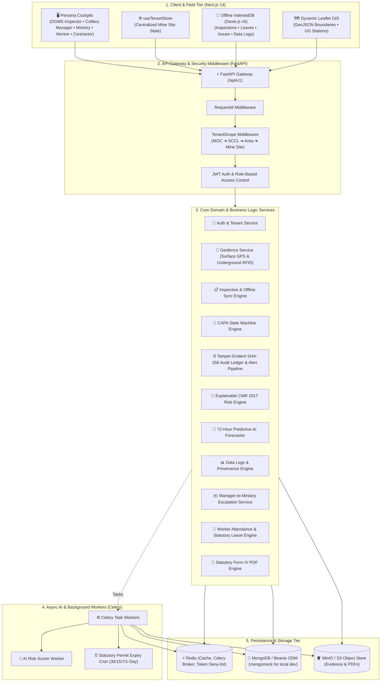

# ⛏️ Coal Mines AI Governance & Statutory Compliance Monitoring System

> **Problem Statement ID: SIH26024** | *Ministry of Coal & DGMS Digital Governance Initiative*  
> An enterprise-grade, offline-first, AI-assisted platform for statutory safety governance, multi-tier compliance monitoring, explainable predictive risk forecasting, cryptographic audit transparency, and resilient field operations across Indian coal mines.

---

## 📌 Executive Summary

Coal mining operations in India operate under rigorous statutory safety, environmental, and operational mandates governed by the **Directorate General of Mines Safety (DGMS)**, **Coal Mines Regulations (CMR 2017)**, **Mines Act 1952**, **CPCB/SPCB**, and **MoEF&CC**.

This platform delivers an end-to-end digital governance architecture engineered for zero-connectivity underground inclines, hierarchical administration (**Ministry ➔ Subsidiary ➔ Area ➔ Mine Site**), dynamic multi-mine GIS positioning, automated CMR 2017 composite risk scoring, forward-looking 72-hour AI hazard forecasting, strict corrective action workflows (CAPA), and tamper-evident cryptographic audit ledger protection.

---

## 🌟 Key Capabilities & Architectural Innovations

### 1. 🛡️ Automatic DGMS & Ministry Tamper Alert Notification Pipeline
- **Immutable Record Enforcement**: Intercepts any local modification attempts on statutory records (shift gas telemetry, worker muster, inspection logs, or CAPA notices) already in `COMMITTED` or `APPROVED` status.
- **Immediate 403 Statutory Rejection**: Rejects unauthorized mutations with `HTTP 403 Forbidden`.
- **Forensic Audit Chaining**: Automatically appends a forensic tamper attempt record to `AuditLedgerModel` with SHA-256 block hash chaining ($H_n = \text{SHA256}(H_{n-1} + \text{Seq} + \text{Payload})$).
- **High-Priority Broadcast**: Instantly dispatches `CRITICAL` priority alerts to `MINISTRY_AUDITOR` and `DGMS_INSPECTOR` notification centers.

### 2. 📊 Dedicated Colliery Manager Data Logs Portal (`/data-logs`)
- **Atmospheric Configuration**: Time-series sensor logs ($\text{CH}_4, \text{CO}, \text{O}_2$, air velocity, temperature) with statutory threshold badges (`NORMAL`, `EXCURSION_WARNING`, `STATUTORY_BREACH`) and provenance SHA-256 hashes.
- **Worker Muster Logs**: Shift biometric timestamps, underground gallery assignments, and statutory overtime flags ($>8\text{h}$).
- **Opencast Mine Casts & Extraction**: Daily bench excavation, tonnage quota vs achievement %, dumper trips, and explosives blasting clearance records.
- **Statutory Tamper Simulation**: Built-in interactive modal demonstrating real-time tamper interception and audit ledger commitment to regulatory auditors.

### 3. ✉️ Manager-to-Ministry Direct Memo Dispatch Channel
- **Emergency Statutory Bridge**: Enables Colliery Managers to dispatch formal statutory memos directly to the Ministry of Coal and DGMS.
- **Automated Telemetry Snapshots**: Auto-bundles live seam gas readings ($\text{CH}_4$, $\text{CO}$) and current risk scores into the memo payload.
- **Cryptographic Audit Assurance**: Generates an immutable SHA-256 audit ledger block upon dispatch.

### 4. 🔮 72-Hour Predictive AI Safety & Hazard Forecaster (`/analytics`)
- **Forward Sequence Modeling**: Projects atmospheric safety trends across $t+24\text{h}$, $t+48\text{h}$, and $t+72\text{h}$ using historical telemetry velocity and acceleration.
- **Dual-Line Visualizer**: Transition from historical sensor data to projected forecasts with shaded 95% Confidence Intervals ($\pm 1.96 \cdot \text{SE} \cdot \sqrt{t/24}$).
- **Statutory Tripwire Warning Engine**: Real-time hazard probability scoring for $\text{CH}_4 \ge 0.75\%$ and $\text{CO}$ rate-of-rise ($>3\text{ ppm/hr}$, spontaneous combustion indicator).

### 5. 📶 Universal Offline-First Architecture (Dexie.js v5)
- **IndexedDB Schema Version 5**: Transparent local storage for worker hazard reports (`worker_issues`), statutory leave applications (`worker_leaves`), operational data logs (`cached_data_logs`), and offline manager actions (`offline_manager_actions`).
- **Two-Way Background Reconciliation**: `flushOfflineSyncQueue` automatically pushes queued submissions (inspection batches via S3 presigned URLs, hazard grievances, and leave applications) to FastAPI endpoints as soon as connectivity is restored.
- **Global Pit Mode Banner**: Real-time indicator displaying network state, queued mutation count, and instant manual sync triggers.

### 6. 🗺️ Reactive Multi-Mine GIS Positioning & Leaflet Mapping
- **Centralized Mine State (`useTenantStore`)**: Global reactive store coordinating selected mine sites across navigation, Leaflet GIS maps, and telemetry grids.
- **Dynamic Leaflet View**: Smoothly pans and zooms to the active mine's coordinates (`center_lat_lng`), renders actual GeoJSON boundary polygons, and outlines active opencast pit zones.
- **Underground Station Markers**: Interactive purple `UG` station beacons with level depth, RFID reader status, and real-time ventilation telemetry popups.

### 7. ⚡ Zero Hydration-Mismatch Architecture
- Fully aligned Next.js App Router Server-Side Rendering (SSR) and client hydration.
- Uses lifecycle mount guards (`mounted`) for browser-dependent APIs (`window.location.search`, `navigator.onLine`) and client stores, ensuring clean console logs across all 22 routes.

---

## 🧠 Explainable CMR 2017 AI Safety Risk Engine

The composite risk calculator evaluates mine safety using a weighted, explainable multi-pillar statutory formula:

$$S_{\text{risk}} = \min\left(100, \; w_g \cdot G + w_c \cdot C + w_m \cdot M + w_e \cdot E + P_{\text{stale}}\right)$$

| Pillar | Weight | Evaluated Parameters | Statutory Regulation |
| :--- | :---: | :--- | :--- |
| **$G$ — Gas & Atmosphere** | **35%** | $\text{CH}_4$ (Methane %), $\text{CO}$ (PPM), $\frac{d\text{CO}}{dt}$ rate of rise, $\text{O}_2$ deficiency | CMR 2017 Reg 153 |
| **$C$ — CAPA Violations** | **25%** | Unrectified statutory violation notices, severity weights, overdue rectifications | CMR 2017 Statutory Orders |
| **$M$ — Mine Depth & Seam** | **20%** | Incline depth (meters), Gassy Seam Degree (Degree I, II, or III) | DGMS Circulars |
| **$E$ — Equipment & Slope** | **20%** | Overdue HEMM maintenance, Opencast Bench Factor of Safety ($\text{FoS}$), 24h rainfall (mm) | CMR 2017 Reg 130 |
| **$P_{\text{stale}}$ — Data Staleness** | **0–15 pt** | Penalty applied when sensor telemetry or shift logs exceed 2, 6, 12, or 24 hours | Data Governance Standard |

---

## 👥 Role-Based Personas & Tailored Hubs

| Persona | Primary Role | Dedicated Cockpit Features |
| :--- | :--- | :--- |
| 🧭 **DGMS Inspector** | Statutory Safety Enforcement | Field audit schedules, GPS geofence breach detection, violation notice issuance, Form-IV PDF generation. |
| 🛡️ **Colliery Manager** | Mine Operations & Compliance | Live pit risk score meter, gas alarm feeds, active worker muster, direct Ministry memo dispatch, CAPA assignments. |
| ⛑️ **Mining Sirdar / Worker** | Ground Safety & Hazard Logging | Biometric shift presence, underground gallery gas monitors, grievance/hazard submissions, offline leave applications. |
| 🏛️ **Ministry Auditor** | National Macro Governance | Pan-India subsidiary compliance heatmap, statutory tamper alert monitor, macro risk analytics. |
| 🚚 **Contractor Admin** | Heavy Machinery & Dispatch | Opencast bench excavation assignments, shift tonnage progress, heavy fleet fitness logs. |

---

## 🏗️ System Architecture



---

## 💻 Tech Stack

| Layer | Technologies |
| :--- | :--- |
| **Backend API** | [FastAPI](https://fastapi.tiangolo.com/), Python 3.11+, Pydantic v2, Structlog |
| **Database & ODM** | [MongoDB 7.0+](https://www.mongodb.com/) via [Beanie ODM](https://beanie-odm.dev/) & Motor (`mongomock` fallback for local dev) |
| **Task Queue & Cache** | [Celery](https://docs.celeryq.dev/), [Redis](https://redis.io/) |
| **Storage** | [MinIO](https://min.io/) / AWS S3 (Presigned URLs) |
| **Frontend Framework** | [Next.js 14.2](https://nextjs.org/) (App Router), [React 18](https://react.dev/), [Tailwind CSS](https://tailwindcss.com/), [Lucide Icons](https://lucide.dev/) |
| **State & Fetching** | [Zustand](https://github.com/pmndrs/zustand), [TanStack React Query v5](https://tanstack.com/query), [Dexie.js v5](https://dexie.org/) (IndexedDB) |
| **Mapping & GIS** | [Leaflet](https://leafletjs.com/), [React-Leaflet](https://react-leaflet.js.org/) |
| **PDF Generation** | ReportLab (Statutory Form-IV & Audit Certificates) |
| **Testing** | [pytest](https://docs.pytest.org/), pytest-asyncio, HTTPX |

---

## 📁 Repository Structure

```text
ai-coal-goverance/
├── app/                                    # Backend Application (FastAPI)
│   ├── api/v1/                             # API Endpoints
│   │   ├── attendance.py                   # Worker check-in, muster & attendance export
│   │   ├── audit.py                        # Cryptographic audit ledger verification
│   │   ├── auth.py                         # Authentication & JWT token refresh
│   │   ├── compliance.py                   # Statutory permits & alert acknowledgment
│   │   ├── dashboard.py                    # Role-tailored dashboard summaries
│   │   ├── documents.py                    # S3 presigned upload & OCR triggering
│   │   ├── escalations.py                  # Manager-to-Ministry official memo dispatch
│   │   ├── inspections.py                  # Inspection logging & Form-IV generation
│   │   ├── logs.py                         # Shift gas, muster & extraction data logs
│   │   ├── notifications.py                # Notification center & acknowledgments
│   │   ├── reports.py                      # Form IV PDF generation & export
│   │   ├── risk.py                         # Composite risk score & 72h forecast endpoints
│   │   ├── router.py                       # Main API v1 routing registry
│   │   ├── schedules.py                    # Preventive safety audit calendars
│   │   ├── sync.py                         # Offline batch push/pull & conflict resolution
│   │   ├── tenants.py                      # Hierarchy & Telangana mine site management
│   │   ├── underground_stations.py         # Depth & RFID beacon stations
│   │   ├── violations.py                   # CAPA workflow state transitions
│   │   └── worker.py                       # Worker issues & statutory leave applications
│   ├── domain/                             # Core Domain Logic (Pure Python)
│   │   ├── enums.py                        # System-wide enum definitions
│   │   ├── predictive_ai.py                # 72-hour AI safety forecaster
│   │   └── risk_scorer.py                  # Explainable CMR 2017 composite risk engine
│   ├── infrastructure/                     # Infrastructure layer
│   │   ├── cache/                          # Redis connection & token denylist
│   │   ├── database/                       # MongoDB Beanie ODM connection & models
│   │   │   ├── models.py                   # 14 Beanie document models (Telemetry, Extraction, etc.)
│   │   │   └── seeds/                      # Master data seed scripts
│   │   │       └── telangana_mines.py      # Telangana SCCL 4-mine master seed
│   │   └── storage/                        # MinIO / S3 object storage service
│   ├── middleware/                         # Request ID, Tenant Scoping, Auth
│   ├── services/                           # Domain Services (Sync, Geofence, CAPA, Audit, PDF)
│   ├── workers/                            # Celery workers & Beat cron schedules
│   ├── config.py                           # App settings via Pydantic Settings
│   ├── dependencies.py                     # FastAPI dependency injections
│   └── main.py                             # FastAPI application factory
├── frontend/                               # Next.js 14 Dashboard
│   ├── src/
│   │   ├── app/                            # App Router routes (22 routes)
│   │   │   ├── (dashboard)/                # Authenticated dashboard pages
│   │   │   │   ├── analytics/              # 72h Predictive AI forecaster & charts
│   │   │   │   ├── attendance/             # Attendance muster & Excel/CSV export
│   │   │   │   ├── audit-ledger/           # Cryptographic SHA-256 ledger view
│   │   │   │   ├── capa/                   # CAPA state machine & notice tracking
│   │   │   │   ├── compliance/             # Statutory permit calendar & CTOs
│   │   │   │   ├── data-logs/              # Colliery shift logs (Atmosphere, Muster, Extraction)
│   │   │   │   ├── inspections/            # Inspection records & Form IV downloads
│   │   │   │   ├── map/                    # Dynamic Leaflet GIS boundary & UG stations
│   │   │   │   ├── overview/               # Multi-persona dashboard hub
│   │   │   │   ├── schedules/              # Scheduled audit calendars
│   │   │   │   └── worker/issues/          # Dedicated worker grievance & hazard portal
│   │   │   └── login/                      # Role-based login page
│   │   ├── components/                     # Modular UI components
│   │   │   ├── alerts/                     # Audit watchdog & tamper alert modal
│   │   │   ├── audit/                      # Cryptographic chain verification banner
│   │   │   ├── capa/                       # CAPA board & status transition modals
│   │   │   ├── dashboard/                  # 5 Persona dashboard views & switcher
│   │   │   ├── geospatial/                 # Leaflet GIS maps & underground levels
│   │   │   ├── inspections/                # Inspection forms & sync status pill
│   │   │   ├── layout/                     # Sidebar, top-navbar, MineSelector & OfflineStatusBar
│   │   │   └── scorecard/                  # Dynamic risk meters & KPI grids
│   │   └── lib/                            # API clients, Dexie DB, Zustand stores
│   │       ├── api/                        # Typed API clients (logs, worker, dashboard, tenants)
│   │       ├── db/                         # Dexie.js v5 offline database (CoalGovOfflineDB)
│   │       ├── store/                      # Zustand stores (auth, tenant, sync, audit-alert)
│   │       ├── sync/                       # Two-way offline sync manager
│   │       └── types/                      # TypeScript domain definitions
├── scripts/
│   └── verify_db.py                        # Database & Redis health check & seeding CLI
├── tests/                                  # Unit & Integration test suite
│   ├── unit/                               # 14 Unit test modules (75 tests)
│   └── integration/                        # Integration test modules
├── .env.example                            # Environment variables template
├── pyproject.toml                          # Python packaging config
└── requirements.txt                        # Python pip dependencies
```

---

## 🔑 Demo User Credentials

All seed accounts use the default password: `demo1234`

| Role | Email | Name & Organization | Hierarchy Scope |
| :--- | :--- | :--- | :--- |
| **`MINISTRY_AUDITOR`** | `auditor.hq@coal.gov.in` | Dr. R. K. Sharma *(MOC Auditor)* | `MOC` (Pan-India) |
| **`DGMS_INSPECTOR`** | `inspector.dgms@dgms.gov.in` | Er. K. Venkat Rao *(DGMS South Central Zone)* | `MOC` (Statutory Jurisdiction) |
| **`COLLIERY_MANAGER`** | `manager.gdk11a@scclmines.com` | N. Ramesh *(Colliery Manager - GDK 11A)* | `MOC.SCCL.RAMAGUNDAM_1.GDK_11A` |
| **`COLLIERY_MANAGER`** | `manager.rgocp3@scclmines.com` | Ch. Srinivas *(Manager - RG-OCP 3)* | `MOC.SCCL.RAMAGUNDAM_2.RG_OCP3` |
| **`COLLIERY_MANAGER`** | `manager.kocp@scclmines.com` | B. Venkateswarlu *(Manager - KOCP Kothagudem)* | `MOC.SCCL.KOTHAGUDEM.KOCP` |
| **`FIELD_WORKER`** | `sirdar.kasipet@scclmines.com` | K. Shankaraiah *(Mining Sirdar - Kasipet)* | `MOC.SCCL.MANDAMARRI.KASIPET_UG` |
| **`CONTRACTOR_ADMIN`** | `contractor.singareni@scclmines.com` | T. Rajesh *(Singareni HEMM Fleet Operations)* | `MOC.SCCL.RAMAGUNDAM_2.RG_OCP3` |

---

## ⚙️ Quickstart & Setup Guide

### 1. Prerequisites
- **Python 3.11+**
- **Node.js 18+ & npm**
- **MongoDB 7.0+** *(Optional: fallback to in-memory `mongomock` is built-in)*
- **Redis 7.0+** *(Optional for local dev)*

---

### 2. Backend Setup

1. **Activate virtual environment:**
   ```bash
   # Windows PowerShell:
   .venv\Scripts\activate
   # Linux / macOS:
   source .venv/bin/activate
   ```

2. **Install Python dependencies:**
   ```bash
   pip install -r requirements.txt
   ```

3. **Configure environment variables:**
   ```bash
   cp .env.example .env
   ```

4. **Verify database & seed master records:**
   ```bash
   python scripts/verify_db.py --seed
   ```

5. **Start the FastAPI Backend Server:**
   ```bash
   uvicorn app.main:app --host 127.0.0.1 --port 8000 --reload
   ```
   - Interactive Swagger API Documentation: `http://127.0.0.1:8000/docs`
   - ReDoc Documentation: `http://127.0.0.1:8000/redoc`

---

### 3. Frontend Setup

1. **Navigate to the frontend directory:**
   ```bash
   cd frontend
   ```

2. **Install Node dependencies:**
   ```bash
   npm install
   ```

3. **Configure environment variables:**
   Ensure `frontend/.env.local` contains:
   ```env
   NEXT_PUBLIC_API_URL=http://localhost:8000/api/v1
   ```

4. **Run development server:**
   ```bash
   npm run dev
   ```
   Open `http://localhost:3000` in your browser.

---

### 4. Background Workers Setup (Optional / Celery)

In a separate terminal (with `.venv` activated):

1. **Start Celery Worker:**
   ```bash
   celery -A app.workers.celery_app.celery_app worker --loglevel=info -Q scoring,documents,default
   ```

2. **Start Celery Beat Cron Scheduler:**
   ```bash
   celery -A app.workers.celery_app.celery_app beat --loglevel=info
   ```

---

## 🧪 Testing & Verification

### Run Backend Test Suite (pytest)
```bash
# Run all 75 unit tests
.venv\Scripts\pytest -v tests/unit/
```
*Current test suite status: **75 passed in ~14s (100% pass rate)***.

### Run Frontend Production Build (Next.js)
```bash
cd frontend
npm run build
```
*Current build status: **Exit Code 0**, 22/22 static & dynamic routes compiled without hydration errors.*

---

## 🎮 Interactive Live Demo Walkthrough

1. **Test Colliery Data Logs & Tamper Rejection (`/data-logs`)**:
   - Log in as Colliery Manager (`manager.gdk11a@scclmines.com`).
   - Navigate to `/data-logs` in the sidebar.
   - Switch between **Atmospheric Configuration**, **Worker Muster**, and **Mine Casts & Extraction**.
   - Under Atmospheric Configuration, click **"Edit"** on any sensor row.
   - Modify a parameter (e.g. CO PPM) and click **"Edit"**.
   - Observe immediate **HTTP 403 Statutory Rejection**, generation of a permanent SHA-256 Audit Block, and instant dispatch of `CRITICAL` alerts to DGMS and Ministry dashboards.

2. **Test Multi-Mine Selector & Dynamic Leaflet GIS (`/map`)**:
   - In the top navigation bar, click the **Mine Selector** dropdown.
   - Switch from **"Godavarikhani No. 11A Incline (SCCL)"** to **"Ramagundam OCP-3 (SCCL)"**.
   - Observe the Leaflet map smoothly re-center to the new mine coordinates, re-draw the active leasehold boundary polygon, and load mine-specific underground station pins.

3. **Test Manager-to-Ministry Official Memo Escalation (`/overview`)**:
   - On the Manager Dashboard, click **`[ ✉️ Dispatch Official Memo to Ministry ]`**.
   - Fill in Category, Subject, and message body. Preview the auto-attached live seam gas telemetry snapshot.
   - Submit the memo; confirm the modal confirms dispatch and returns the cryptographic SHA-256 block hash.

4. **Test 72-Hour Predictive AI Forecaster (`/analytics`)**:
   - Navigate to `/analytics`.
   - Scroll to the **72-Hour Predictive AI Safety & Hazard Forecaster**.
   - Inspect the dual-line trend showing the transition from historical telemetry to projected levels with shaded 95% Confidence Intervals.
   - View the +24h, +48h, and +72h milestone cards displaying predicted methane percentage and spontaneous heating rate-of-rise.

5. **Test Universal Offline Pit Mode & Dexie Sync (`/worker/issues`)**:
   - In browser DevTools Network tab, toggle **Offline**.
   - Notice the amber **"Offline Mode — Offline Pit Mode Active"** status bar.
   - Submit a hazard report or leave application.
   - Inspect DevTools IndexedDB (`CoalGovOfflineDB`); verify the record is persisted with `is_synced: 0`.
   - Re-enable network; observe the banner transition to **"Online — Syncing Queued Operations..."** and auto-flush to the server.

---

## 📜 Statutory Compliance & Legal Reference

- **Coal Mines Regulations (CMR 2017)**: Regulations 130, 153, and 154 (Ventilation, Mine Gases, and Slopes).
- **Mines Act, 1952**: Section 22A, Section 38 (Powers of DGMS Inspectors and Statutory Records).
- **Mines Rules, 1955**: Chapter VII (Statutory Leave and Attendance Muster).

---

## 📄 License

Developed under the **Smart India Hackathon (SIH26024)** initiative for the **Ministry of Coal, Government of India**.  
Distributed under the MIT License.
